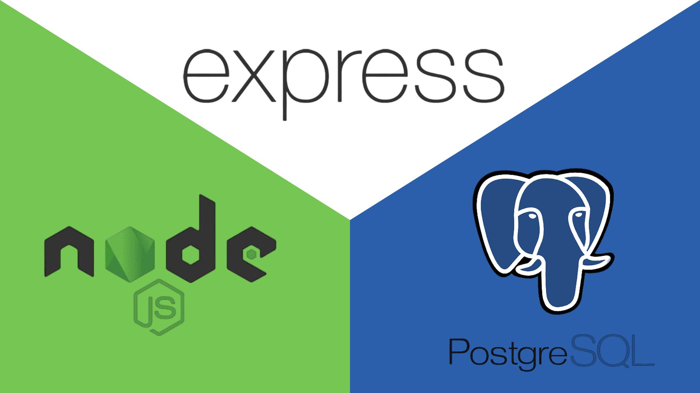

<p align="center">

</p>

# Project - 03 Blog Api - App

## Project Description

This project is an API for a blog, which will allow users to register, start a section, upload a post, comment on a post, view a post, upload images, and go to the user profile. The application is built using node.js express.js and uses PostgresSQL as a database to store the information.

[Here you will find the API documentation, click here to use it in your projects](https://documenter.getpostman.com/view/28473907/2s9YRCVWQY)

## Main characters

1. create post

2. upload images

3. register user

4. log in with a user

5. uses websockets so that when a post is created, that post is issued to all clients

6. comment Post

7. delete Post

8. Update Post

# Used technology

1. express: a minimalist node.js framework that makes it easy to create web applications and APIs.

2. express-rate-limit: is a middleware used to limit repeated requests to public APIs and/or endpoints such as authentication and password reset.

3. express-validator: It is a data validation middleware for Express. Provides validation and sanitization of input data.

4. helmet - is a security middleware that helps protect Express/Connect applications from some of the known web vulnerabilities by setting appropriate HTTP headers.

5. postgreSQL: is an open source, object-oriented relational database management system.

6. firebase: A web and mobile application development platform that provides real-time databases and authentication services to allow developers to create applications.

7. sequelize: An ORM (Object Relational Mapper) for SQL databases. which simplifies working with SQL databases by writing JavaScript code instead of SQL.

8. jsonwebtoken – is a JSON Web Tokens (JWT) implementation for Node.js that allows the creation and verification of JWT tokens.

9. socket.io – is a JavaScript library for real-time web applications. It allows real-time bidirectional communication between clients and web servers.

## Prerequisites for using the project

1. have node.js installed

2. have postgresSQL installed

3. have a database created in postgresSQL

## How to execute the project

1. clone the repository

2. run the following command to install the dependencies:

```

  npm install

```

3. create a local database in postgresSQL

4. Create an app in Firebase and initialize the Firestore in it

5. clone the .env.template and rename it to .env and fill the environment variables

6. Wake up development mode with the following command:

```

  npm run start:dev
```
